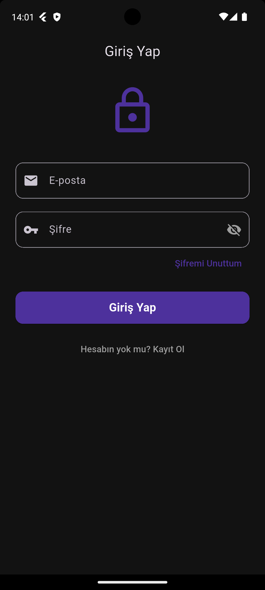
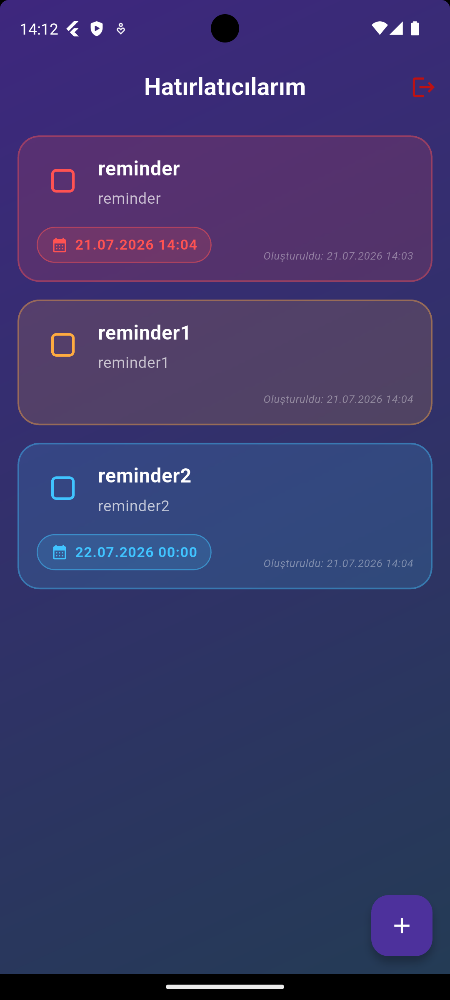
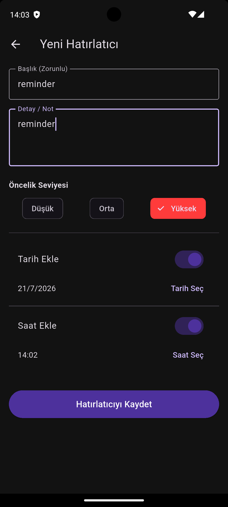
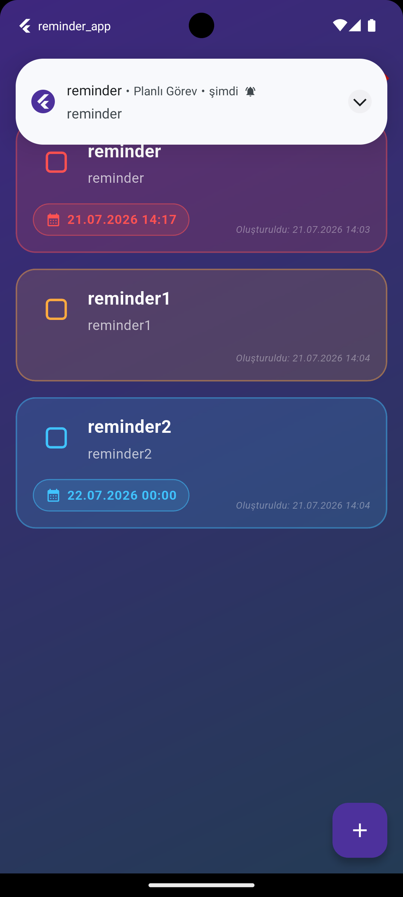

```markdown
<div align="center">
  <a href="#english">En English</a> &nbsp;|&nbsp; <a href="#türkçe">Tr Türkçe</a>
</div>

---

<span id="english"></span>
# Reminder and Task Management Application

This project constitutes a Flutter-based mobile application designed to facilitate the organization of daily tasks, assignment of priority levels, and delivery of scheduled local notifications. The development process strictly adheres to a service-oriented architecture and modular design principles.

## Screenshots
<p align="center">
  
  
  
  
</p>


## Core Features
* **User Management (Firebase Auth):** Secure registration and authentication mechanisms utilizing email and password credentials, mandatory email verification protocols, and password recovery infrastructure.
* **Real-Time Database (Cloud Firestore):** Isolated storage of task data delineated by User ID (UID), enabling instantaneous retrieval, updating, and deletion (CRUD operations).
* **Scheduled Local Notifications:** Implementation of exact time-based notifications utilizing `flutter_local_notifications` and the Android AlarmManager, ensuring reliable delivery even when the application is terminated or operating in the background.
* **Task Prioritization:** Assignment of weighted numerical priority levels—Low (0), Medium (1), and High (2)—with seamless synchronization to backend Firestore models.
* **User Experience (UX):** Integration of swipe gestures on the primary interface for rapid deletion and seamless transition to the editing state. Implementation of dynamic date and time selection components.

## Technologies and Dependencies
* **Framework:** Flutter & Dart
* **Backend Infrastructure:** Firebase (Authentication, Cloud Firestore)
* **Chronological Processing:** `intl`, `timezone`, `flutter_timezone`
* **Notification Engine:** `flutter_local_notifications`

## Project Architecture and Directory Structure
The repository is structured to enhance code maintainability and readability, following standard architectural paradigms:

```text
lib/
│
├── models/
│   └── reminder_model.dart        # Data bridge between the application and Firestore (Serialization/Deserialization)
│
├── screens/
│   ├── login_screen.dart          # Authentication interface with validation and password reset logic
│   ├── register_screen.dart       # User registration interface including password matching and verification alerts
│   ├── home_screen.dart           # Primary interface rendering task lists with swipe-to-edit/delete functionalities
│   ├── add_reminder_screen.dart   # Data entry form for new tasks, including chronological and priority parameters
│   └── edit_reminder_screen.dart  # Modification interface populated with pre-existing task data
│
└── services/
    ├── auth_service.dart          # Firebase Authentication operations
    ├── firestore_service.dart     # Cloud Firestore CRUD operations
    └── notification_service.dart  # Timezone configuration and local notification scheduling

```

## Installation and Setup

### 1. Prerequisites

* Flutter SDK (Version 3.x or higher)
* Android Studio, IntelliJ IDEA, or VS Code
* An active Firebase Account

### 2. Repository Cloning

Execute the following commands in your terminal to clone the repository to your local environment:

```bash
git clone <repository-url>
cd <project-folder>
flutter pub get

```

### 3. Firebase Integration

1. Initialize a new project via the Firebase Console.
2. Register your Android application (utilizing the `applicationId` located in `android/app/build.gradle`).
3. Download the provided `google-services.json` file and place it within the `android/app/` directory of your project.
4. Enable the *Email/Password* provider under the **Authentication** tab in the Firebase Console.
5. Initialize a new database under the **Firestore Database** tab.

### 4. Firestore Security Rules

To ensure data isolation and security, update your Firestore rules as follows:

```javascript
rules_version = '2';
service cloud.firestore {
  match /databases/{database}/documents {
    match /reminders/{document=**} {
      // Restrict read, update, and delete access to the authenticated owner of the document
      allow read, update, delete: if request.auth != null && request.auth.uid == resource.data.userId;
      // Allow document creation solely for authenticated users
      allow create: if request.auth != null;
    }
  }
}

```

### 5. Execution

Following the configuration, connect an emulator or a physical device and compile the application:

```bash
flutter run

```

## Developer

Burcpercin

---

---

# Hatırlatıcı ve Görev Yönetimi (Reminder App)

Bu proje, kullanıcıların günlük işlerini organize etmelerini, görevlerine öncelik atamalarını ve zamanı geldiğinde yerel bildirimler ile haberdar olmalarını sağlayan Flutter tabanlı bir mobil uygulamadır. Geliştirme sürecinde servis tabanlı mimariye ve modüler yapıya sadık kalınmıştır.

## Ekran Görüntüleri

## Temel Özellikler

* **Kullanıcı Yönetimi (Firebase Auth):** E-posta ve şifre ile güvenli kayıt/giriş, zorunlu e-posta doğrulama mekanizması ve şifre sıfırlama (şifremi unuttum) altyapısı.
* **Gerçek Zamanlı Veritabanı (Cloud Firestore):** Görevlerin kullanıcı kimliğine (UID) göre izole bir şekilde saklanması, anlık olarak listelenmesi, güncellenmesi ve silinmesi (CRUD).
* **Zamanlanmış Yerel Bildirimler:** Uygulama tamamen kapalı veya arka planda olsa dahi `flutter_local_notifications` ve Android AlarmManager kullanılarak cihaz saatine göre çalışan kesin (exact) bildirimler.
* **Görev Önceliklendirme:** Düşük (0), Orta (1) ve Yüksek (2) olmak üzere sayısal ağırlıklı öncelik seviyeleri ve bu seviyelerin Firestore modelleriyle tam senkronizasyonu.
* **Kullanıcı Deneyimi (UX):** Ana ekranda kaydırma (swipe) jestleri ile hızlı silme ve düzenleme sayfasına geçiş özellikleri. Dinamik tarih ve saat seçiciler.

## Kullanılan Teknolojiler ve Paketler

* **SDK:** Flutter & Dart
* **Backend:** Firebase (Authentication, Cloud Firestore)
* **Tarih & Saat İşlemleri:** `intl`, `timezone`, `flutter_timezone`
* **Bildirim Motoru:** `flutter_local_notifications`

## Proje Mimarisi ve Klasör Yapısı

Proje, kodun okunabilirliğini ve bakımını kolaylaştırmak için aşağıdaki dizin yapısına göre tasarlanmıştır:

```text
lib/
│
├── models/
│   └── reminder_model.dart        # Firestore ile uygulama arasındaki veri köprüsü (Serialization/Deserialization)
│
├── screens/
│   ├── login_screen.dart          # Giriş yapma, boş alan kontrolü ve şifre sıfırlama arayüzü
│   ├── register_screen.dart       # Yeni kayıt, şifre eşleşme ve e-posta doğrulama uyarısı
│   ├── home_screen.dart           # Görevlerin listelendiği, kaydırma aksiyonlarının (swipe-to-edit/delete) olduğu ana sayfa
│   ├── add_reminder_screen.dart   # Yeni görev, tarih, saat ve öncelik ekleme formu
│   └── edit_reminder_screen.dart  # Mevcut görevleri mevcut verilerle doldurarak düzenleme arayüzü
│
└── services/
    ├── auth_service.dart          # Firebase Auth işlemleri (Giriş, çıkış, kayıt, mail gönderme)
    ├── firestore_service.dart     # Firestore CRUD (okuma/yazma/silme/güncelleme) işlemleri
    └── notification_service.dart  # Zaman dilimi ayarları ve yerel bildirim kurulumları

```

## Kurulum Adımları

### 1. Ön Gereksinimler

* Flutter SDK (Sürüm 3.x ve üzeri)
* Android Studio, IntelliJ veya VS Code
* Aktif bir Firebase Hesabı

### 2. Projeyi İndirme

Terminalinizi açın ve projeyi yerel bilgisayarınıza klonlayın:

```bash
git clone <repository-url>
cd <project-folder>
flutter pub get

```

### 3. Firebase Entegrasyonu

1. Firebase Console üzerinden yeni bir proje oluşturun.
2. Projeye Android uygulamanızı ekleyin (Projenizin `android/app/build.gradle` içindeki `applicationId` değerini kullanarak).
3. Firebase tarafından verilen `google-services.json` dosyasını indirip uygulamanızın `android/app/` dizininin içine yerleştirin.
4. Firebase konsolundan **Authentication** sekmesine giderek *Email/Password* sağlayıcısını etkinleştirin.
5. **Firestore Database** sekmesine giderek yeni bir veritabanı oluşturun.

### 4. Firestore Güvenlik Kuralları (Security Rules)

Kullanıcıların yalnızca kendi verilerine erişebilmesi için Firestore kurallarınızı şu şekilde güncelleyin:

```javascript
rules_version = '2';
service cloud.firestore {
  match /databases/{database}/documents {
    match /reminders/{document=**} {
      allow read, update, delete: if request.auth != null && request.auth.uid == resource.data.userId;
      allow create: if request.auth != null;
    }
  }
}

```

### 5. Çalıştırma

Tüm yapılandırmaları tamamladıktan sonra bir emülatör veya fiziksel cihaz bağlayarak projeyi derleyin:

```bash
flutter run

```

## Geliştirici

Burcpercin

```
```bash
git add README.md
git commit -m "fix(docs): resolve markdown rendering issues and restore image visibility"
git push

```